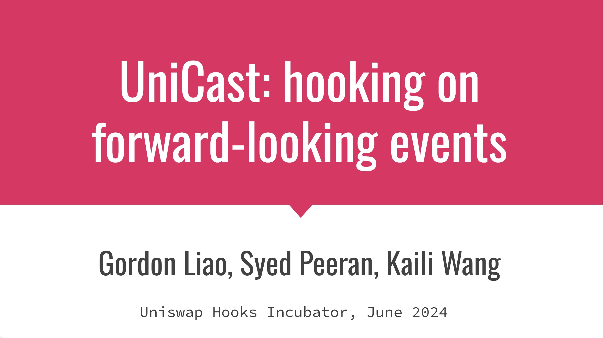
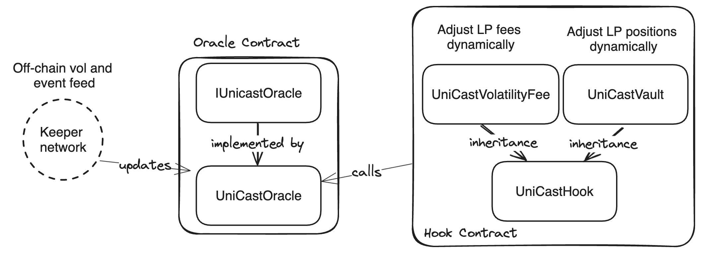
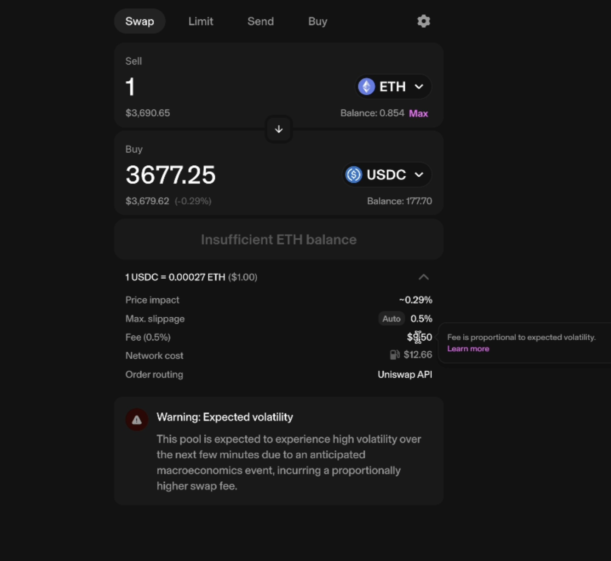

# UniCast

UniCast is a forward-looking dynamic Uniswap v4 hook that applied event-based and market-implied volatility to adjust LPfees and LP positions.

### Context:
Volatilities rise predictably during expected events like CPI releases, Fed rate announcements, SEC ETF approval dates, and TradFi “off-market” hours.
Price changes are predictable and LP “impermanent losses” are permanent for tokens with coupon payments, such as liquid staking rebasing, bond coupons, and equity dividends.

### Problem:
Arbitrageurs capture all expected price and volatility changes at the expense of LPs.
These predictable arbitrages harm liquidity, lead to MEV leaks, and deter swappers due to poor liquidity

### Solution: 
UniCast: A hook that adjusts LP fees and positions by incorporating:
Forward-looking volatility to enable dynamic fees and shift value capture from arbs to LPs
Forward-looking price changes to rebalance LP positions

**Features**:
- Improving LP return using forward-looking events and expected price dynamics rebalancing/fee.
- Reduce informed trading (and MEV in the dex context) during known events is something that all tradfi market makers do, and this hook bring this tradfi practice to on-chain dex
- Anticipate and preposition toward future events and expected pricing dynamics:
1) Economic news release schedule, e.g. CPI, NFPR, Fed interest rate decisions 1b) Crypto-specific events, e.g. ETF approval announcement, policy votes
2) Forward-looking volatility implied by options market (Deribit, Panoptics, Opyn)
3) Yield-bearing assets rebalancing, e.g. StETH/ETH pool, USDY/USDC pool

**Details**
 ([Slides in pdf](assets/Slides.pdf))

## Technical notes 
### Contract architecture

### Notes
1. During rebalance, the vault needs to modify its token0:token1 ratio to fit the new range. Currently, the math behind the rebalancing (determining the new liquidity value of the position after rebalancing to the new range) makes the assumption that the price in the pool will stay the same throughout the rebalance (see /assets/unicast_math.md). In the implementation however, the vault swaps with the pool itself during rebalancing, so this assumption is most likely untrue unless there is a tremendous amount of liquidity in the pool already coming from other LPs outside of the vault. 
To make this assumption true, the vault could instead swap with a different pool or on-chain DEX just for the rebalancing itself. Or, the math could be reworked to not require this assumption. 
2. In practice, the rebalancing does not need to happen as part of the afterSwap hook; it doesn't need to really be a hook at all. It would live on a separate vault contract, and the rebalance can simply be triggered periodically directly, not needing to check the oracle first. This was simply implemented as a hook here to show how it could be done, and also because this was built for the Uniswap Hookathon. 

**UI**

